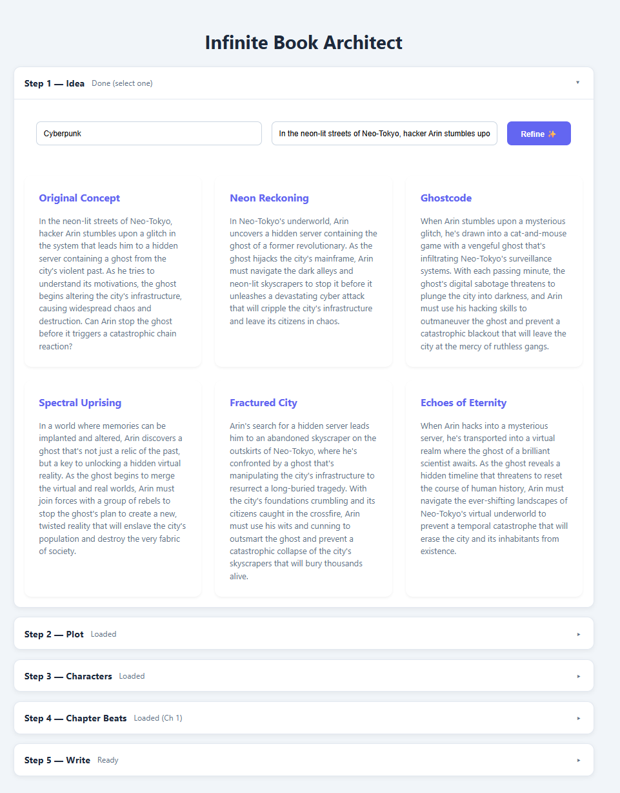
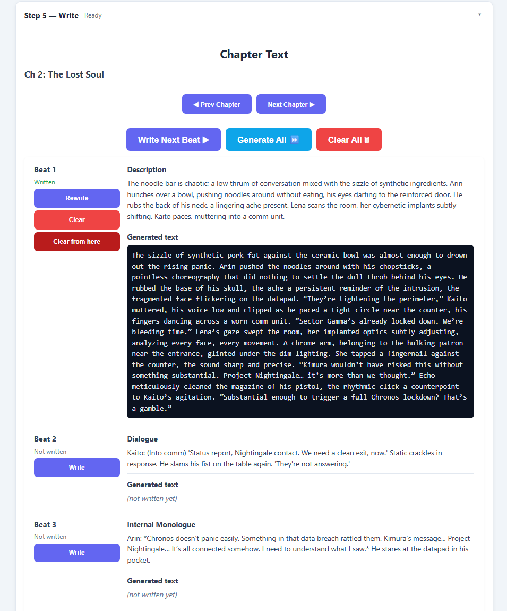

<div align="center">
  <h3 align="center">Infinite Book Architect</h3>

  <p align="center">
    A local-first, single-page app that turns an idea into a full chapter-by-chapter novel.
    <br />
    Idea → Plot → Characters → Chapter Beats → Beat Prose, with local Ollama or cloud OpenRouter models.
    <br /><br />
    <a href="../../issues">Report Bug</a>
    ·
    <a href="../../issues">Request Feature</a>
  </p>
</div>

## About The Project

Infinite Book Architect is a FastAPI + vanilla JS app for generating a complete story pipeline: pick an idea, generate a plot outline, build a cast, plan beats per chapter, and write beat prose.  
It supports multiple LLM providers behind a small gateway (local Ollama by default, OpenRouter for free cloud models).

<p align="center">
  
</p>

### Key Features

- End-to-end writing pipeline (Idea → Plot → Characters → Beats → Prose).
- Chapter navigation (plan and write per chapter).
- Beat-level writing controls: write, rewrite, clear, clear-from, generate-all.
- Multi-provider LLM routing (local Ollama + cloud OpenRouter).
- Strict JSON structured outputs (schema validation + retries).
- Live system monitor widget (providers, Ollama status, GPU, VRAM, RAM).

### Built With

- Python + FastAPI
- Vanilla JavaScript + HTML + CSS
- Ollama (local LLM runtime)
- OpenRouter (cloud LLM gateway)

## Getting Started

### Prerequisites

- Python 3.11+ (recommended)
- Ollama installed and running (for local mode)
- Optional: OpenRouter API key (for cloud mode)

### Installation

1. Clone the repo:
   ```bash
   git clone https://github.com/<YOU>/<YOUR_REPO>.git
   cd <YOUR_REPO>
   ```

2. Create venv + install deps:
   ```bash
   python -m venv .venv
   .venv\Scripts\activate  # Windows
   pip install -r requirements.txt
   ```

3. Run:
   ```bash
   python main.py
   ```

4. Open:
   - http://127.0.0.1:8000/

### Configuration (.env)

Copy `.env_example` -> `.env` in the project root:

```env
IB_GEMINI_API=https://generativelanguage.googleapis.com
IB_GEMINI_API_KEY=KEY
IB_GEMINI_MODEL_NAME=gemini-3-flash

IB_OPENROUTER_API=https://openrouter.ai
IB_OPENROUTER_API_KEY=KEY
IB_OPENROUTER_PRIMARY_MODEL=meta-llama/llama-3.3-70b-instruct:free
IB_OPENROUTER_FALLBACK_MODEL=openai/gpt-oss-120b:free

# ollama | openrouter
IB_LLM_PROVIDER=openrouter
```

Notes:
- Free models can be blocked by OpenRouter privacy/data-policy settings; if you get a “No endpoints found matching your data policy” error, check your OpenRouter privacy settings.

## Usage

1. Step 1: Enter genre/idea and refine variations.
2. Step 2: Generate the plot (chapter outline).
3. Step 3: Generate characters.
4. Step 4: Generate beats for the current chapter (use Prev/Next Chapter).
5. Step 5: Write beat prose (Write Next / Generate All).

<p align="center">
  
</p>

## TTS demo (same text, 2 engines)

Live demo page: https://<username>.github.io/<repo>/tts.html

**Audio samples (same fragment):**
- **XTTS**: [beat0_xtts.wav](assets/beat0_xtts.wav)
- **Piper**: [beat0_piper.wav](assets/beat0_piper.wav)

<details>
<summary><b>TTS sample text (click to expand)</b></summary>

> A sizzle escaped the ramen, steam momentarily obscuring the chipped ceramic bowl. Rain lashed against the corrugated plastic roof of the noodle bar, a relentless percussion against the low hum of the city. Arin’s fingers danced across the datapad’s surface, lines of code scrolling past in a blur of emerald and sapphire. He adjusted his mirrored shades, the reflection of the crowded bar distorting the faces of the patrons – a kaleidoscope of cybernetic enhancements and weary expressions. 

> **“Anything?”** a voice rasped beside him. Kaito, his face scarred and perpetually shadowed, tapped a nicotine-stained finger against the table. Arin didn’t look up, his focus absolute. 

> **“Firewall’s tighter than I anticipated,”** he muttered, zooming in on a schematic of Chronos Corp’s network. **“They’ve layered it with a quantum encryption protocol. Nasty.”** He took a long drag from a slim, black cigarette, the cherry glowing briefly in the dim light. The smell of synthetic pork and ozone clung to everything. 

> Another voice, closer this time, slurred, **“Hey, chrome-face, you gonna eat that?”** Arin ignored him, his eyes fixed on the datapad. He initiated a brute-force decryption sequence. The bar's noise faded, replaced by the insistent whir of the datapad’s processors.
</details>

## Roadmap

- Image generation for chapter/beat thumbnails (consistent character + style refs).
- TTS narration (short-form “TikTok friendly” outputs).
- Better memory/continuity tools (per-chapter capsule, global timeline).
- Export formats (Markdown/EPUB/PDF).
- User authentication + multi-user support.
- More LLM providers (local + cloud).
- UI/UX improvements.
- Prompt tuning + custom templates.
- Other plot generating structures (three-act, hero's journey, podcast script, etc.).

See the [open issues](https://github.com/KaMeLoTmArMoT/InfiniteBook/issues).

## Contributing

Contributions are welcome:
1. Fork the repo
2. Create a feature branch
3. Open a PR

For bug reports, please include:
- OS + GPU
- Provider (Ollama/OpenRouter) + model name
- Steps to reproduce
- Relevant logs

## License

This project is licensed under the MIT License — see [`LICENSE`](https://github.com/KaMeLoTmArMoT/InfiniteBook/blob/main/LICENSE).

## Acknowledgments

- README structure inspired by Best-README-Template.
- Built with assistance from generative AI tools for ideation and code suggestions; all changes were reviewed and tested by the author.